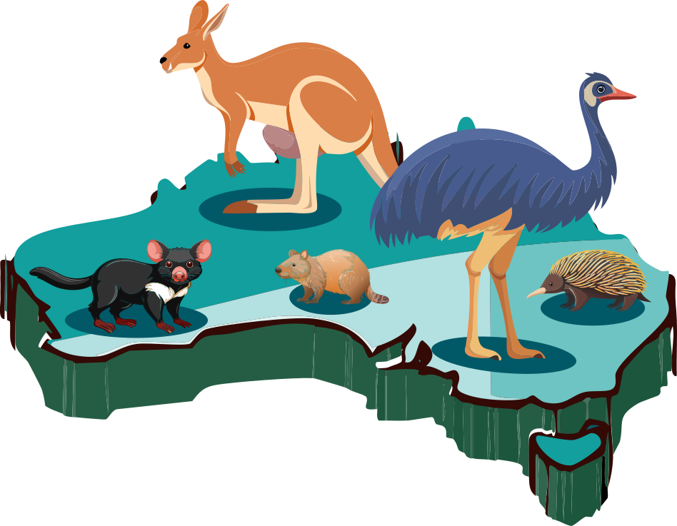

<div style="display: flex; align-items: center;">
  
  
</div>

# WildObsR

<!-- badges: start -->
[](https://www.r-project.org/)
[](https://opensource.org/licenses/MIT)
[](https://app.codecov.io/gh/WildObs/WildObsR)
<!-- badges: end -->

> Professional tools for camera trap data access, management, and analysis in R

WildObsR provides a suite of functions for standardizing, accessing, and analyzing wildlife camera trap data. This R package is built to support the [Camera Trap Data Package (Camtrap DP)](https://camtrap-dp.tdwg.org/) data standard, built around the [Frictionless Data Package ](https://specs.frictionlessdata.io/data-package/) specifications to ensure camera trap data remains [Findable, Accessible, Interoperable, & Reusable (FAIR)](https://ardc.edu.au/resource-hub/making-data-fair/).

---

## Installation

```r
# Install from GitHub
# install.packages("devtools")
devtools::install_github("WildObs/WildObsR")
```

---

## Key Features

### Data Access & Management
- **MongoDB Integration**: Query and download camera trap data from WildObs' internal database via API
- **Flexible Filtering**: Query projects by spatial bounds, temporal ranges, species, contributors, and sampling design
- **Schema Validation**: Enforce data quality with Camtrap DP schema checking and type coercion

### Data Processing
- **Spatial Resampling**: Spatially resample observations and deployments to custom spatial buffers to aggregate camera data for hierarchical analyses. 
- **Matrix Generation**: Build detection/non-detection matrices, and site- and observation-level covariates for occupancy & abundance modeling formatted for the [`unmarked` R library](https://rbchan.github.io/unmarked/)

### Spatio-temporal Enhancement
- **Location Enrichment**: Automatically assign protected area names using the [Collaborative Australian Protected Areas Database (CAPAD)](https://www.dcceew.gov.au/environment/land/nrs/science/capad), bioregions using the [Interim Biogeographic Regionalisation for Australia (IBRA)](https://www.dcceew.gov.au/environment/land/nrs/science/ibra), and Australian states using [ozmaps](https://mdsumner.github.io/ozmaps/)
- **Spatial & Temporal Buffers**: Create buffers of any size around camera deployments and identify spatially and resolve temporally overlapping deployments.

---

## Quick Start

### Query WildObs database

```r
library(WildObsR)

# Use general API key
api_key <- "f4b9126e87c44da98c0d1e29a671bb4ff39adcc65c8b92a0e7f4317a2b95de83"

# Query projects in Queensland from 2020-2024
spatial_query <- list(xmin = 145.0, xmax = 154.0, ymin = -29.0, ymax = -10.0)
temporal_query <- list(minDate = as.Date("2020-01-01"),
                       maxDate = as.Date("2024-12-31"))

project_ids <- wildobs_mongo_query(
  api_key = api_key,
  spatial = spatial_query,
  temporal = temporal_query,
  tabularSharingPreference = c("open", "partial")
)

# Download data packages
dp_list <- wildobs_dp_download(
  api_key = api_key,
  project_ids = project_ids,
  media = FALSE,              # Set TRUE to include media files for a slower download
  metadata_only = FALSE       # Set TRUE to access metadata only for a quick download
)

# Access deployments
deployments <- frictionless::read_resource(dp_list[[1]], "deployments")
# Access observations
observations <- frictionless::read_resource(dp_list[[1]] "observations")
```

### Spatially resample data 

```r
# Assign spatial scales
# 'scales' defines the area (in square meters) covered by a hexagonal cell
scales <- c(1000000, 3000000) # 1 km and 3 km 

# Generate spatial hexagons based on the provided scales
deployments <- WildObsR::spatial_hexagon_generator(deployments, scales)

# Define columns for mode aggregation (example: 'source' and 'habitat')
mode_cols_covs <- names(covs)[grepl("source|habitat", names(covs))]

# Set the method for aggregating the total number of individuals detected:
individuals <- "sum"  # Alternative: "max"

# Specify observation-level covariate variables derived from deployments.
# These variables capture information that varies in space and time.
obs_covs <- c("baitUse", "featureType", "setupBy", "cameraModel", "cameraDelay","cameraHeight", "cameraDepth", "cameraTilt", "cameraHeading", "detectionDistance", "deploymentTags")

# now spatially resample the data, noting that this function may take a few minutes to run
resamp_data = WildObsR::resample_covariates_and_observations(covs, obs, 
individuals = "sum", mode_cols_covs, obs_covs)

# Select the resampled observations and covs at the 1 km scale
resamp_obs = resamp_data$spatially_resampled_observations$cellID_1km
resamp_covs = resamp_data$spatially_resampled_covariates$cellID_1km

```

### Create abundance and/or occupancy matricies for hierarchical modeling

```r
# Run the matrix generator function on the spatially resampled observations and deployments
res <- matrix_generator(
  obs = resamp_obs,
  covs = resamp_covs,      
  dur = 110,                  # maximum duration of a survey 
  w = 3,                      # sampling occasion window, as the numeber of days to collapse
  site_covs = c("Avg_human_footprint_10km2", "Avg_FLII_3km2", "locationName"),  # site covariates 
  obs_covs = c("numberDeploymentsActiveAtDate", "cameraHeight", "featureType"), # observation covariates
  all_locationNames = TRUE,   # include all data, even where species was not detected
  scientificNames = c("Orthonyx spaldingii", "Uromys caudimaculatus"), # species to create matricies 
  type = "abundance",         # abundance or occupancy?
  individuals = "sum",        # sum or maximum number of individuals per cell
)
# Access the detection matrix for one species:
res[["Orthonyx_spaldingii"]][["detection_matrix"]]

```

---

## Core Functions

| Category | Functions |
|----------|-----------|
| **Data Access** | `wildobs_mongo_query()`, `wildobs_dp_download()`, `extract_metadata()` |
| **Spatial** | `AUS_state_locator()`, `ibra_classification()`, `locationName_buffer_CAPAD()`
| **Data Wrangling** | `survey_and_deployment_generator()`, `resample_covariates_and_observations()`, `matrix_generator()` |
| **Quality Control** | `check_schema()`, `apply_schema_types()` |

---

## Data Standards

WildObsR adheres to community standards for open and reproducible camera trapping research:

- **[Camera Trap Data Package (Camtrap DP)](https://camtrap-dp.tdwg.org/)**: TDWG standard for camera trap data exchange
- **[Frictionless Data Package](https://specs.frictionlessdata.io/data-package/)**: Specification for self-describing data
- **[Darwin Core](https://dwc.tdwg.org/)**: Biodiversity data standard for taxonomic and occurrence information

Data packages downloaded from WildObs include:
- **Project metadata**: Contributors, licenses, sampling methodology, spatial/temporal coverage, & taxonomic scope. Metadata also contains schemas with definitions, types, constraints for all data fields. 
- **Deployments**: Camera deployments, locations, setup dates, habitat covariates, as indicated by `deploymentID`.
- **Observations**: Independent detections of species, as indicated by `observationID`.
- **Media**: All media (*i.e.*, images and or video) with filePaths to accessible images, as indicated by `mediaID`. 
- **Covariates**: Environmental values derived from shape files for each coordinate (*e.g.*, elevation), as indicated by `deploymentID`.

---

## Spatial Data Sources

Location enrichment functions utilize authoritative Australian spatial datasets:

- **[CAPAD (2022)](https://www.environment.gov.au/land/native-vegetation/capad)**: Collaborative Australian Protected Areas Database
- **[IBRA7](https://www.dcceew.gov.au/environment/land/nrs/science/ibra)**: Interim Biogeographic Regionalisation for Australia
- **Australian State Boundaries**: Official administrative boundaries

---

## WildObs Platform

WildObsR interfaces with the [WildObs](https://wildobs.org.au) camera trap database, a collaborative platform for Australian wildlife monitoring data. The database supports:

- **Open Science**: Data sharing with flexible privacy controls (open/partial/closed)
- **Standardization**: Automated validation against Camtrap DP schemas
- **Discoverability**: Spatial/temporal/taxonomic queries across contributed datasets
- **Embargo Periods**: Configurable data release schedules for research protection

Access requires an API key. Contact [wildobs-support@qcif.edu.au](mailto:wildobs-support@qcif.edu.au) for keys with appropriate permissions.

---

## Documentation

Comprehensive documentation for all functions:

```r
# View function help
?wildobs_mongo_query
?survey_and_deployment_generator
?matrix_generator

# Browse package overview
help(package = "WildObsR")
```

Each function includes:
- Detailed parameter descriptions
- Return value specifications
- Working examples with sample data
- References to relevant standards and methods

---

## Contributing

We welcome contributions! Please:

1. Fork the repository
2. Create a feature branch (`git checkout -b feature/your-feature`)
3. Write tests for new functionality
4. Ensure `devtools::check()` passes with no errors
5. Submit a pull request and we will review your new feature! 

---

## Testing

WildObsR uses comprehensive unit testing:

```r
# Run all tests
devtools::test()

# Run specific test file
testthat::test_file("tests/testthat/test-matrix_generator.R")

# Check package
devtools::check()
```

Current test coverage: 120+ tests across spatial, data wrangling, and database functions.

---

## Citation

If you use WildObsR in your research, please cite:

```
Amir, Z., Bruce, T., & Contributors. (2024). WildObsR: Professional tools for camera trap data access, management, and analysis in R. R package version 0.1.0.
https://github.com/WildObs/WildObsR
```

---

## License

MIT License - see [LICENSE](LICENSE) file for details.

---

## Support

- **Issues**: [GitHub Issues](https://github.com/WildObs/WildObsR/issues)
- **WildObs Support**: wildobs-support@qcif.edu.au
- **Maintainer**: Zachary Amir (z.amir@uq.edu.au)

---

## Acknowledgments

WildObsR development is supported by:

- **Queensland Cyber Infrastructure Foundation (QCIF)**
- **Terrestrial Ecosystem Research Network (TERN)**
- **Australian Research Data Commons (ARDC)**
- **Atlas of Living Australia (ALA)**
- **University of Queensland, School of the Environment**
